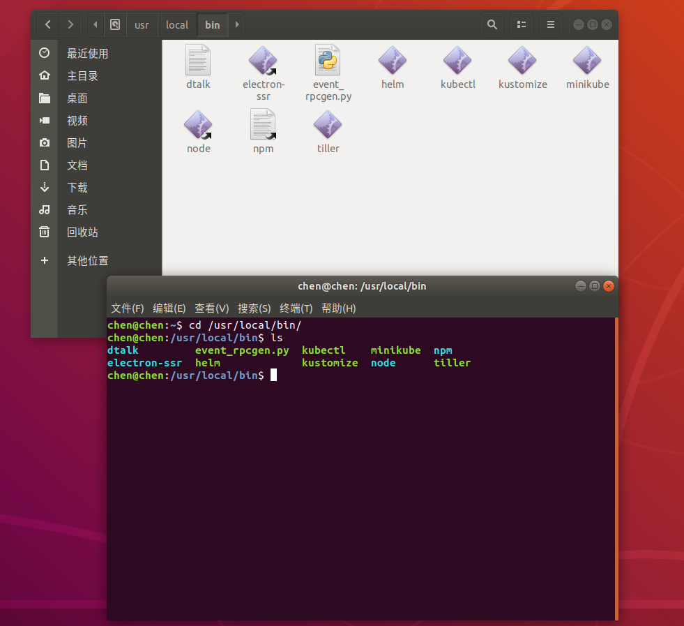
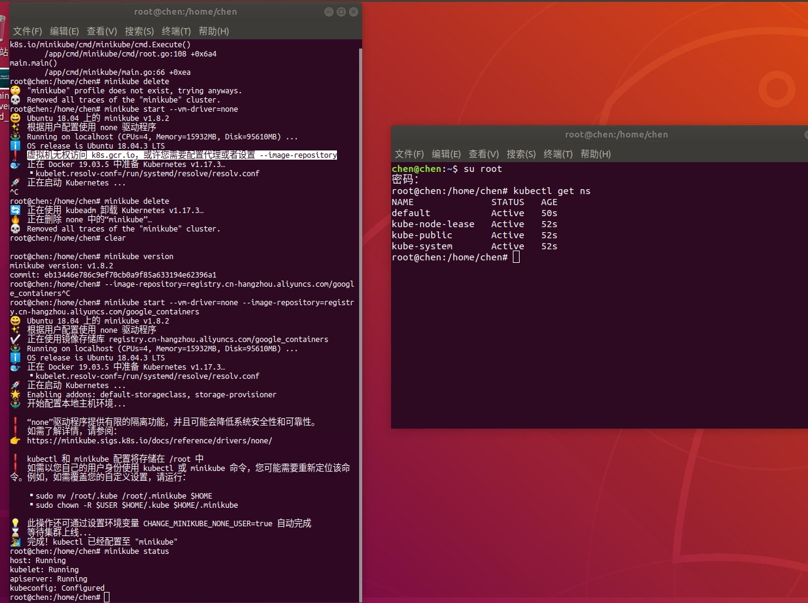
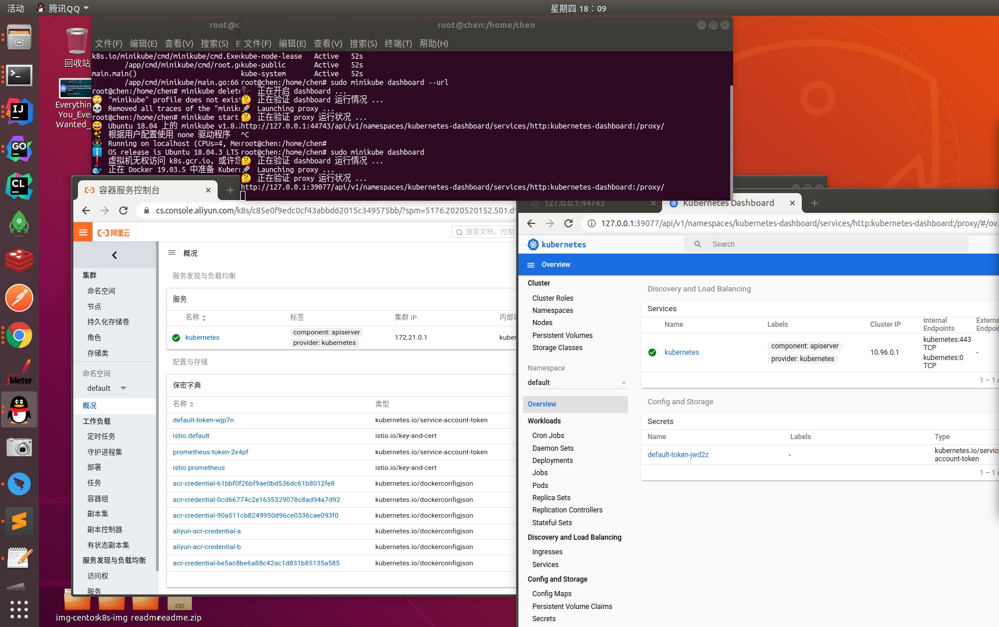

# ubuntu系统上本地搭建单机版的Kubernetes集群minikube(笔记)

# minikube安装官网：
    https://kubernetes.io/docs/tasks/tools/install-minikube/
    
## minikube安装(cmd操作)
    a.下载并安装到【/usr/local/bin/】路径下(查看install-site.png)
        curl -Lo minikube https://storage.googleapis.com/minikube/releases/latest/minikube-linux-amd64 \
          && chmod +x minikube
              
        sudo mkdir -p /usr/local/bin/    
        sudo install minikube /usr/local/bin/
  
        
    b.本地启动K8S服务cmd(查看local-start-k8s.jpg)
        minikube start --vm-driver=none --image-repository=registry.cn-hangzhou.aliyuncs.com/google_containers
    查看启动状态cmd
        minikube status
      
    
    c.获取网页访问K8S地址cmd(查看local-webPage-access-k8s.jpg)
        minikube dashboard
         
        
     
    
    
